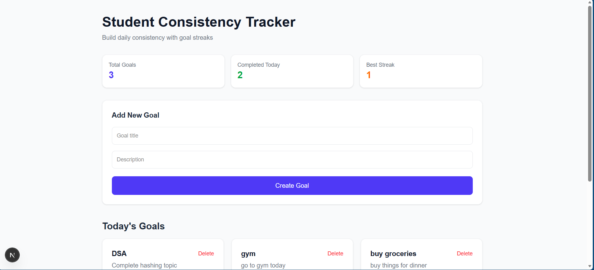

# 🎯 Student Consistency & Streak Tracker

# 🎯 Student Consistency & Streak Tracker

## 📸 Dashboard Preview



A full-stack web application that helps students stay consistent with daily goals by tracking completion and maintaining streaks.

Users can create goals like solving DSA problems, studying, or going to the gym, and the system tracks their daily progress and calculates streaks automatically.

---

# 🚀 Features

• Create and manage daily goals
• Track streaks based on consecutive completions
• Mark goals as completed for the day
• Handle missed days with optional reason tracking
• View streak history calendar
• Dashboard showing today's goals and progress

---

# 🧠 How Streak Calculation Works

Instead of storing streak numbers directly, the system calculates streaks using completion history.

Example:

| Date  | Status    |
| ----- | --------- |
| Mar 1 | Completed |
| Mar 2 | Completed |
| Mar 3 | Completed |
| Mar 4 | Missed    |

Current streak = **0**
Longest streak = **3**

This approach avoids incorrect streak counts and keeps the data consistent.

---

# 🏗️ Tech Stack

Frontend
• Next.js
• Tailwind CSS

Backend
• FastAPI
• SQLAlchemy

Database
• PostgreSQL

Deployment
• Vercel (Frontend)
• Render (Backend)

---

# 📂 Project Structure

```
goal-streak-tracker
│
├── backend
│   ├── app
│   │   ├── db
│   │   ├── models
│   │   ├── routes
│   │   ├── services
│   │   └── main.py
│
└── frontend
    ├── app
    ├── components
    └── services
```

---

# 📊 Dashboard

The dashboard allows users to:

• View today's goals
• Track current streaks
• Mark goals completed
• View completion history

---

# ⚙️ Running the Project Locally

Clone the repository:

```
git clone https://github.com/YOUR_USERNAME/goal-streak-tracker.git
```

Backend setup:

```
cd backend
python -m venv venv
venv\Scripts\activate
pip install -r requirements.txt
uvicorn app.main:app --reload
```

Frontend setup:

```
cd frontend
npm install
npm run dev
```

Open in browser:

```
http://localhost:3000
```

---

# 🎯 Purpose of the Project

This project demonstrates:

• Full-stack development
• REST API design
• Database schema design
• Streak calculation algorithm
• Modern dashboard UI development

---

# 📌 Future Improvements

• User authentication
• Multi-user support
• Advanced streak analytics
• GitHub-style activity heatmap
• Mobile responsive design
